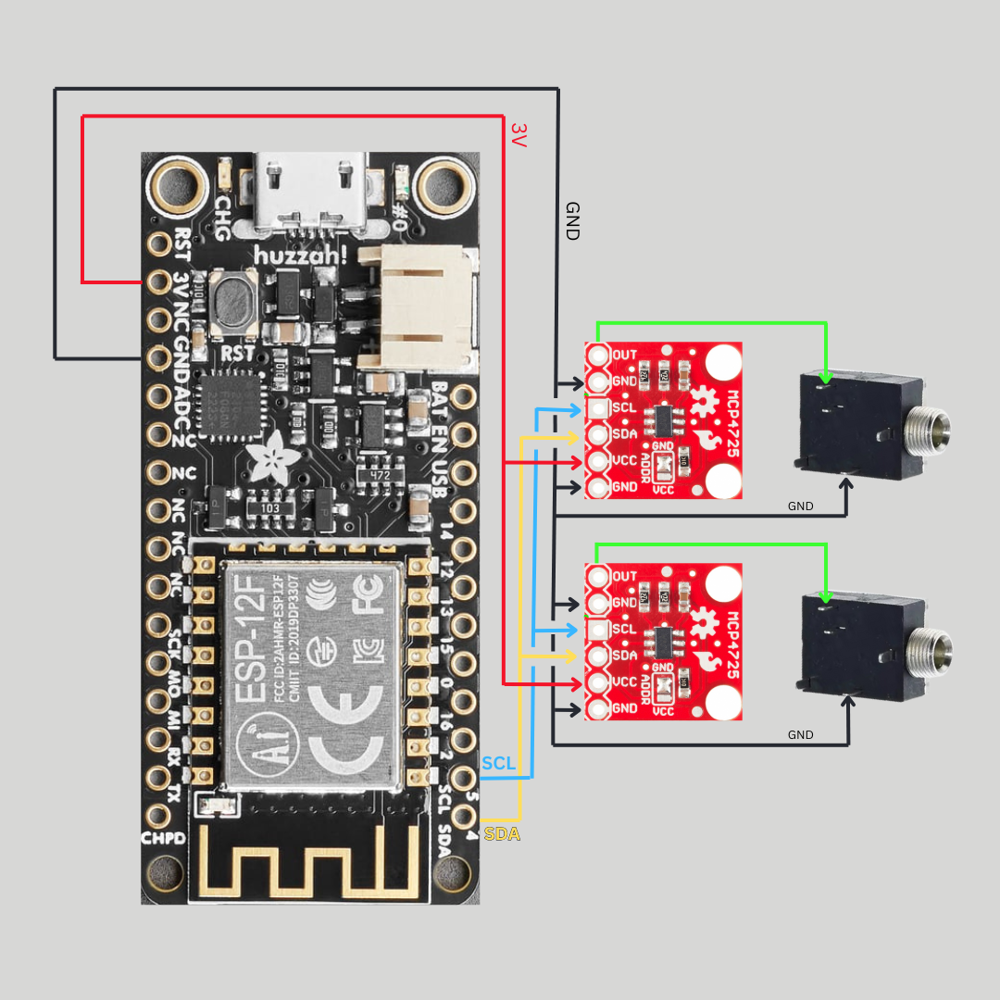
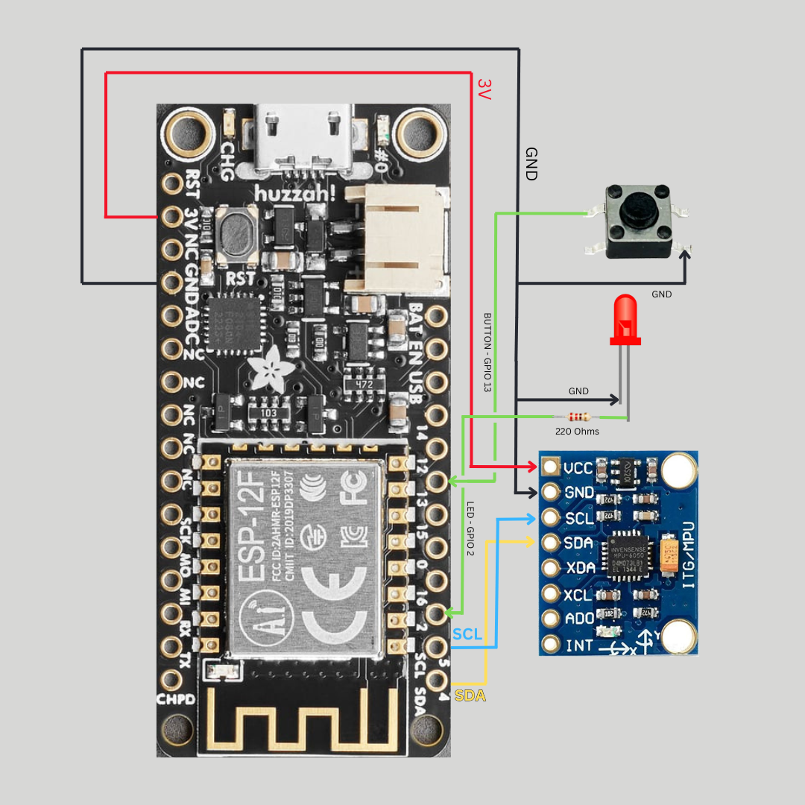
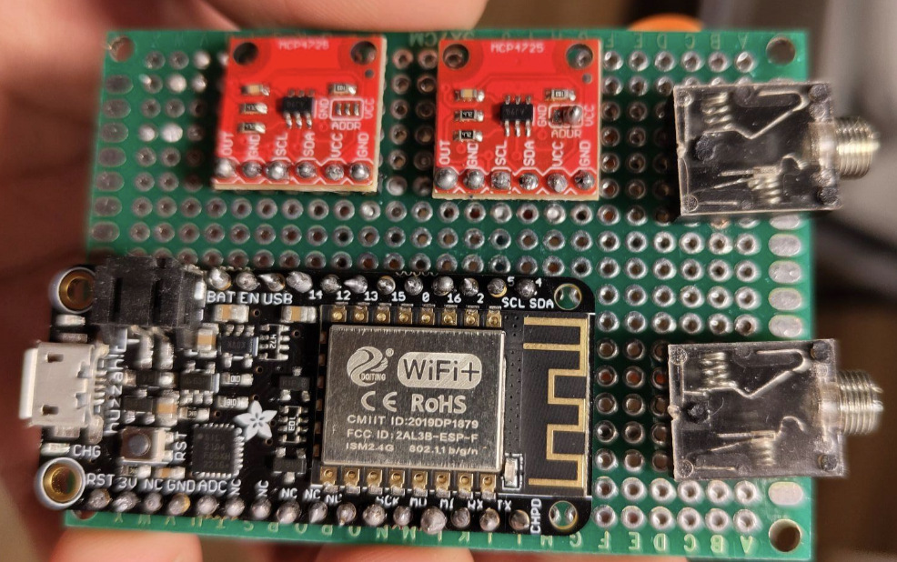
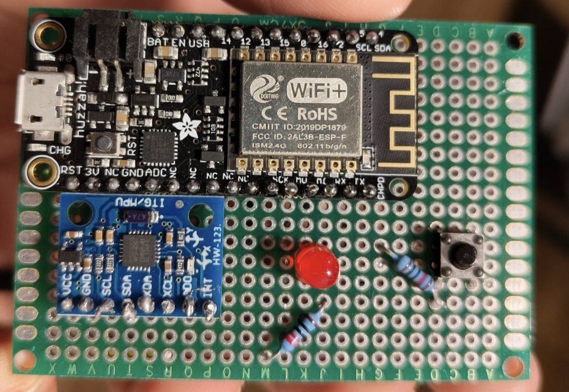

# Wireless-CV-module - V1
Wireless CV over network for Eurorack Synth

## INTRODUCTION

This project is a wireless control voltage (CV) module made for eurorack format synthesizers/voltage processing modules that uses tilt gestures to modulate sound. It comprises two separate Adafruit Feather HUZZAH ESP8266 modules that communicate over WiFi. One module (the sender) houses an MPU6050 accelerometer, which captures tilt data (i.e., the sensor's orientation in space). This tilt data is then transmitted wirelessly to the receiver module. The receiver processes the tilt information, scales it to a normalized range (0-4095), and uses two MCP4725 digital-to-analog converters (DACs) to output control voltages. These voltages can interface with analog synthesizers or modular systems, thus translating physical movements into sonic modulation.

The overall aim is to create an expressive interface that leverages natural gestures to control electronic sound. By mapping tilt data directly to control voltages, the performer can modulate parameters such as pitch, filter cutoff, or amplitude through subtle tilting movement while controlling some other instrument remotely. The design is minimalist and wireless, reducing clutter on stage while emphasizing the physicality of performance.

## CONCEPT & TECHNOLOGICAL DETAILS

The system is implemented using two ESP8266-based Feather HUZZAH boards, which offer a compact, WiFi-enabled platform ideal for wireless performance systems.

On the sender module, an MPU6050 sensor is connected via I²C to the Feather. The sensor is set up to capture acceleration data on its X and Y axes. These values represent the tilt of the sensor, essentially, the orientation of the performer's hand or body relative to gravity. The sender code continuously reads the sensor data and, if a designated button (wired with an internal pull-up on the board at General Purpose Input-Output Pin 13 (GPIO13)) is pressed, sends a CSV-formatted message over WiFi. The message is structured as "accX,accY,1" followed by a newline, where "1" indicates that the sensor is active. This design allows the performer to control when the tilt data is sent, providing an on/off toggle for the modulation effect.

On the receiver module, a WiFi server is initiated to listen for incoming sensor data on port 80. Once the data is received, it is parsed to extract the X and Y tilt values and an enable flag. The receiver then uses a mapping function to normalize these tilt values. For example, the system might assume a tilt range of –3.0 to +3.0 m/s², mapping –3.0 to 0, 0.0 to 0.5, and +3.0 to 1. This normalized value is then multiplied by 4095, the maximum value for a 12-bit DAC, ensuring the full voltage range is utilized. Two separate DAC chips (MCP4725) are employed, one driven by the normalized X tilt and the other by the normalized Y tilt, providing two independent CV outputs that can modulate different parameters on a synthesizer.

The project's code is written in Arduino C/C++ and takes advantage of libraries such as the ESP8266WiFi library for wireless connectivity, the Adafruit_MPU6050 library for sensor interfacing, and the Adafruit_MCP4725 library for controlling the DAC chips.

## CHALLENGES AND WORK NEEDED

1) REASON FOR USING ONLY ONE SENSOR (instead of 3 as required by the assignment) - Since I had the constraint of only two DACs, I could not utilize more than two sensor values (here I have chosen X and Y tilt values from the accelerometer). This also constrained me to use either two sensors, or one sensor with two value outputs. And since using two different sensors would mean engaging two hands, or changing of hands, or putting down the sender module to interact with two different sensors, I chose to use one sensor that could send two values at the same time.

2) Since there is only one pair of I²C communication pins (SDA and SCL), the two MCP4725 DAC chips need to be set on different addresses. This can be done by desoldering the jumper and soldering the middle pad to VCC. This changes the address of the chip from 0x60 to 0x61. In this way, we can use two DAC chips at the same time.

3) The 3 dimensional array of acceleration X, acceleration Y and an enable flag of '1' needs to be packed in a CSV string of the form (accX, accY, 1). This string is sent in packets to the receiver module and decoded by the receiver module. This was beyond my technical knowledge and I had to read a lot of forums in order to understand and execute it.

4) Every time the module is powered off, it not only has to be reconnected to the WIFI again but a part of the IP address also refreshes to a new one. For this issue, I had to print the IP address by connecting the Receiver module to the IDE and then replace the IP address in the sender module code and resend the whole code to the sender module. As long as the module is on and connected to a predefined WIFI connection, it functions smoothly.

## FUTURE WORK & GOALS

1) Expand the module from 2 CV outputs to 4 CV outputs using the MCP4728 chip, which has four DACs in one chip.

2) Concurrently add more sensors like joysticks.
